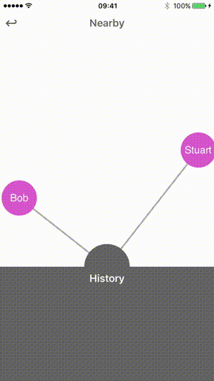

# p2pkit.io Check-me-in

A simple demo app emulating a check-in-like functionality.



## Get Started

1. Using p2pkit requires an application key, start by creating a p2pkit account here:
[Create p2pkit account](http://p2pkit.io/signup.html)

2. Once you have an account you can log-in to the console and create an application key: [Create your Application Key](https://p2pkit-console.uepaa.ch/login)

  > **Note:** p2pkit validates the BundleID so don't forget to add ``ch.uepaa.p2pkit-checkin-ios`` to the known BundleIDs when creating your application key.

3. This app requires ``P2PKit.framework`` which needs to be downloaded separately, please follow the instructions here:
[Download p2pkit](http://p2pkit.io/developer/get-started/ios/#download)

4. Drag ``P2PKit.framework`` to the project folder

5. Head to the ``AppDelegate.swift`` file and replace ``<YOUR APPLICATION KEY>`` with your created app key:

  ```
  PPKController.enable(withConfiguration: "<YOUR APPLICATION KEY>", observer: self)
  ```

> In general, a tutorial as well as all other documentation is available on the developer section of our website:
[http://p2pkit.io/developer](http://p2pkit.io/developer)


## How to use

You need at least two devices to test the app.

1. Start the app on the first device, enter a name and publish.
2. Repeat step 1 on the second device.
3. Go to the check-in view by tapping the arrow on top. You should see the other device appear as a circle in the upper part of the screen with the entered name.
4. Bring both phones in close proximity and wait a few seconds for the check-in confirmation.
5. Check-out works the same way as the check-in, but the devices first need to be physically moved further away.

## p2pkit License
* This demo DOES NOT IMPLY fit for service/application for such a check-in functionality. You are responsible for evaluating p2pkit for your particular use case.
* By using P2PKit you agree to abide by our Terms of Service, License Agreement and Policies which are available here: http://p2pkit.io/policy.html
* Please refer to "Third_party_licenses.txt" included with P2PKit.framework for 3rd party software that P2PKit.framework may be using - You will need to abide by their licenses as well


```
Copyright 2017 Uepaa AG

Licensed under the Apache License, Version 2.0 (the "License");
you may not use this file except in compliance with the License.
You may obtain a copy of the License at

 http://www.apache.org/licenses/LICENSE-2.0

Unless required by applicable law or agreed to in writing, software
distributed under the License is distributed on an "AS IS" BASIS,
WITHOUT WARRANTIES OR CONDITIONS OF ANY KIND, either express or implied.
See the License for the specific language governing permissions and
limitations under the License.

```
